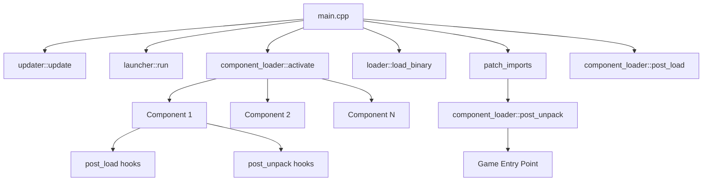
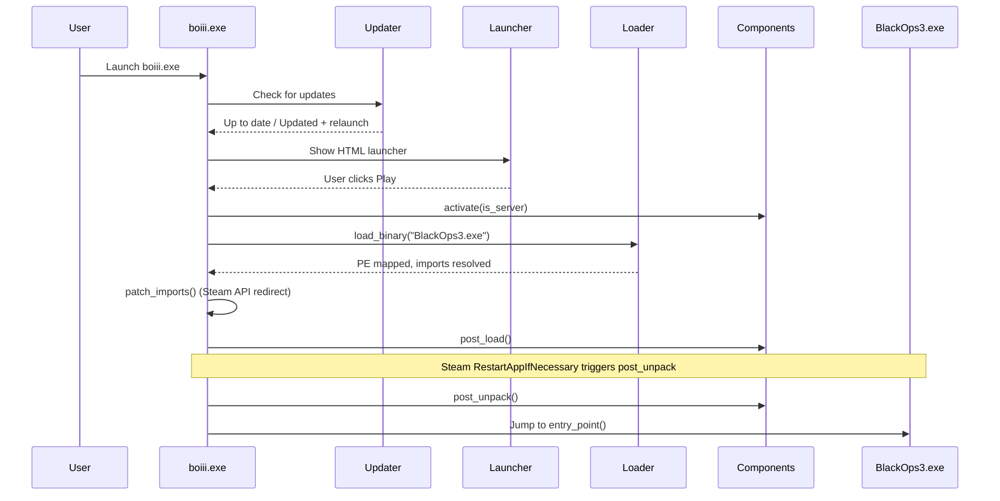
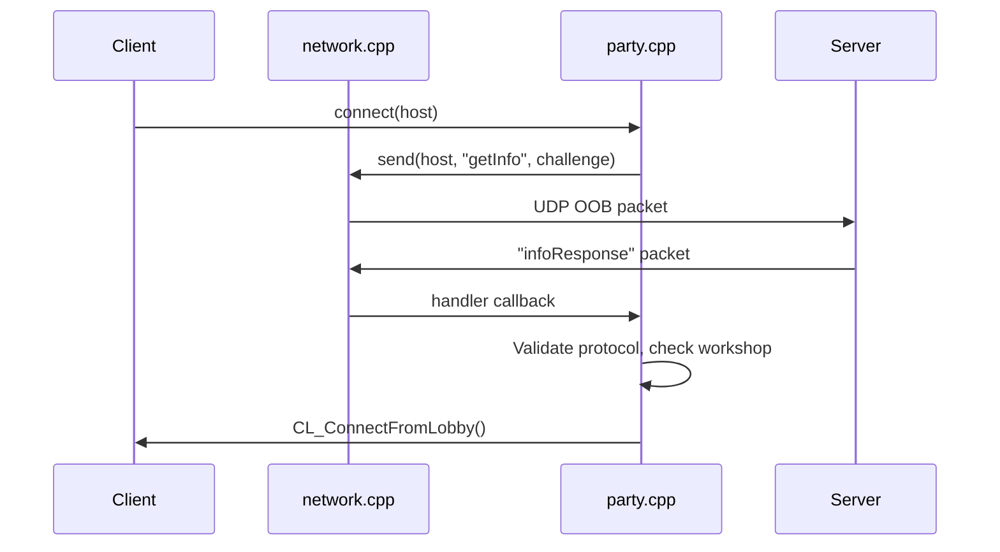
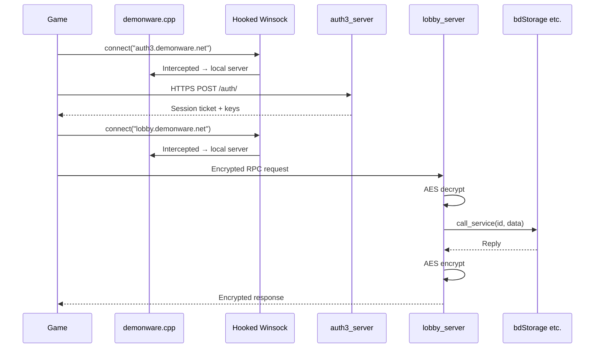

# BOIII Codebase Knowledge Document

> **Generated:** 2026-03-08
> **Codebase:** ~37,100 lines of C++ across 180+ source files
> **Language:** C++20 (MSVC, Windows x64 only)
> **Build System:** Premake5 → Visual Studio 2022

---

## Table of Contents

1. [High-Level Overview](#1-high-level-overview)
2. [Architecture](#2-architecture)
3. [Startup & Lifecycle](#3-startup--lifecycle)
4. [Component System](#4-component-system)
5. [Feature Catalog](#5-feature-catalog)
6. [Cross-Cutting Concerns](#6-cross-cutting-concerns)
7. [Data Flow Diagrams](#7-data-flow-diagrams)
8. [Technical Reference](#8-technical-reference)
9. [Gotchas & Subtleties](#9-gotchas--subtleties)
10. [Glossary](#10-glossary)

---

## 1. High-Level Overview

### What It Is

BOIII is a **Windows DLL-injection-style client** for Call of Duty: Black Ops III. It replaces the game's Steam authentication, networking, and online services with custom implementations, enabling:

- Play without Steam ownership verification
- Custom server browser (LAN + Internet)
- Dedicated server hosting
- Steam Workshop mod/map downloading without Steam
- Loot/cosmetic unlocking
- Custom GSC scripting
- Lua UI modifications
- Discord Rich Presence
- Auto-updating

### How It Works

`boiii.exe` is placed in the BO3 game directory. On launch, it:
1. Updates itself from a remote server
2. Shows an HTML launcher UI
3. Loads the real `BlackOps3.exe` into its own process via PE manual mapping
4. Patches the game's IAT to redirect Steam API calls to custom stubs
5. Activates ~40 "component" modules that hook game functions
6. Transfers control to the game's entry point

### Target Users

- Players who want to play BO3 multiplayer/zombies without Steam verification
- Server operators hosting dedicated BO3 servers
- Modders creating custom maps, game modes, and UI modifications

### Tech Stack

| Layer | Technology |
|-------|-----------|
| Language | C++20 (MSVC) |
| Build | Premake5 → VS2022 `.sln` |
| Hooking | MinHook (detours) + AsmJit (JIT assembly stubs) |
| Disassembly | udis86 (x86-64 instruction decoder) |
| Crypto | LibTomCrypt + LibTomMath |
| HTTP | libcurl |
| JSON | RapidJSON |
| Compression | zlib |
| UI (launcher) | Embedded IE11 ActiveX control via OLE |
| UI (in-game) | HKS Lua (game's built-in scripting) |
| Networking | Winsock2 (raw UDP/TCP) |
| Discord | discord-rpc |
| Image | stb_image |

### Dependencies (in `deps/`)

| Dependency | Purpose |
|-----------|---------|
| `asmjit` | x86-64 JIT assembler for runtime code generation |
| `curl` | HTTP client for updates and workshop downloads |
| `discord-rpc` | Discord Rich Presence integration |
| `imgui` | (present but not actively used in components) |
| `libtomcrypt` | Cryptographic primitives (AES, 3DES, ECC, RSA, SHA) |
| `libtommath` | Big-number math backend for libtomcrypt |
| `minhook` | x64 function hooking (detour library) |
| `rapidjson` | JSON parsing for configs, DW responses, updates |
| `stb` | Image loading (PNG for splash screen) |
| `udis86` | x86-64 disassembler for Steam interface analysis |
| `zlib` | Compression for network data and DW resources |

---

## 2. Architecture

### Directory Structure

```
boiii/
├── premake5.lua              # Build configuration
├── generate.bat              # Runs premake5 to generate VS solution
├── src/
│   ├── client/               # Main application
│   │   ├── main.cpp          # Entry point (WinMain)
│   │   ├── std_include.hpp   # Precompiled header
│   │   ├── resource.hpp      # Win32 resource IDs
│   │   ├── component/        # ~40 feature modules (the core of BOIII)
│   │   ├── game/             # Game engine types, symbols, and emulation
│   │   │   ├── structs.hpp   # Reverse-engineered game structures
│   │   │   ├── symbols.hpp   # Game function addresses (client + server)
│   │   │   ├── demonware/    # Demonware online services emulation
│   │   │   └── ui_scripting/ # HKS Lua value/execution helpers
│   │   ├── launcher/         # Pre-game HTML launcher UI
│   │   │   └── html/         # IE ActiveX embedding
│   │   ├── loader/           # PE loader and component lifecycle
│   │   ├── steam/            # Steam API emulation layer
│   │   │   └── interfaces/   # ISteamUser, ISteamFriends, etc. stubs
│   │   ├── updater/          # Auto-update system
│   │   └── resources/        # Embedded binary resources (DW data)
│   ├── common/               # Shared utility library
│   │   ├── utils/            # Hook, crypto, IO, string, HTTP, etc.
│   │   └── exception/        # Minidump crash handler
│   └── tlsdll/               # TLS callback helper DLL
├── deps/                     # Third-party dependencies (git submodules)
├── data/                     # Runtime data files
│   ├── launcher/             # HTML/CSS/JS for launcher UI
│   ├── ui_scripts/           # Custom Lua UI scripts
│   ├── scripts/              # Custom GSC game scripts
│   ├── gamesettings/         # Override game settings CFGs
│   └── lookup_tables/        # Dvar name resolution table
├── old-dll/                  # Historical ext.dll versions
└── tools/                    # premake5.exe
```

### Build Projects (from `premake5.lua`)

| Project | Kind | Description |
|---------|------|-------------|
| `client` | WindowedApp (`boiii.exe`) | Main executable; includes all of `src/client/` |
| `common` | StaticLib | Shared utilities linked into `client` |
| `tlsdll` | SharedLib | Minimal DLL for TLS index allocation |
| Dependencies | StaticLibs | Each dep under `deps/` has its own premake project |

### Architecture Pattern

**Plugin/Component Architecture** with a centralized lifecycle manager.

Each feature is a self-contained "component" class that:
- Inherits from `generic_component`, `client_component`, or `server_component`
- Self-registers at static initialization time via `REGISTER_COMPONENT(ClassName)`
- Receives lifecycle callbacks: `post_load()`, `post_unpack()`, `pre_destroy()`
- Uses `utils::hook` to patch game functions at runtime



---

## 3. Startup & Lifecycle

### Boot Sequence (`src/client/main.cpp`)

```
WinMain()
  └─ main()
       ├─ handle_process_runner()        // If "-proc PID": wait for parent, exit
       ├─ enable_dpi_awareness()         // Set DPI awareness
       ├─ validate_non_network_share()   // Reject UNC paths
       ├─ remove_crash_file()            // Clean .start sentinel
       ├─ updater::update()              // Download updates, may relaunch
       ├─ Check launcher HTML exists     // First-run internet requirement
       ├─ Detect client vs server binary // BlackOps3.exe vs _UnrankedDedicatedServer.exe
       ├─ trigger_high_performance_gpu() // Registry GPU preference
       ├─ launcher::run()                // Show HTML launcher (client only, unless -launch)
       ├─ component_loader::activate()   // Instantiate matching components
       ├─ loader::load_binary()          // Manual PE map of game exe
       ├─ Validate binary checksums      // is_server/is_client/is_legacy_client
       ├─ patch_imports()                // Redirect Steam API + ExitProcess + DPI
       ├─ component_loader::post_load()  // Early component initialization
       ├─ [Steam RestartAppIfNecessary]  // Triggers post_unpack via hook
       └─ entry_point()                  // Jump to game code
```

### Component Lifecycle

| Phase | When | What Happens |
|-------|------|-------------|
| Constructor | Static init | `REGISTER_COMPONENT` calls `register_component()` |
| `activate(server)` | Before binary load | Factory functions instantiated; filtered by type; sorted by priority |
| `post_load()` | After binary loaded, before IAT patching | Early hooks (exception handler, icon, extension loading) |
| `post_unpack()` | After IAT patching, before game runs | Main hook installation phase (most components do their work here) |
| `pre_destroy()` | On process exit | Cleanup (Discord shutdown, etc.) |

### Priority Order (highest first)

```
arxan         → Anti-tamper bypass (must run first)
updater       → Self-update check
steam_proxy   → Steam overlay/integration
name          → Player name resolution
min (default) → Everything else
```

---

## 4. Component System

### Component Interface (`src/client/loader/component_interface.hpp`)

```cpp
enum class component_type { client, server, any };

struct generic_component {
    static constexpr auto type = component_type::any;
    virtual void post_load() {}
    virtual void pre_destroy() {}
    virtual void post_unpack() {}
    virtual component_priority priority() const { return component_priority::min; }
};

struct client_component : generic_component {
    static constexpr auto type = component_type::client;
};

struct server_component : generic_component {
    static constexpr auto type = component_type::server;
};
```

### Registration Mechanism (`src/client/loader/component_loader.hpp`)

```cpp
#define REGISTER_COMPONENT(name)                   \
namespace {                                        \
    component_loader::installer<name> __component; \
}
```

The `installer<T>` template registers a factory lambda at static init time. During `activate()`, factories matching the current mode (client/server/any) are called and components are sorted by priority.

### Component Loader Implementation (`src/client/loader/component_loader.cpp`)

- Components stored in a `vector<unique_ptr<generic_component>>` with a custom deleter that calls `pre_destroy()`.
- `activate()` filters by type and sorts by priority (descending).
- `post_unpack()` and `pre_destroy()` call `TerminateProcess` on failure to prevent partial state corruption.
- `trigger_premature_shutdown()` throws a `premature_shutdown_trigger` exception caught by `activate()`.

---

## 5. Feature Catalog

### 5.1 Anti-Tamper Bypass (`component/arxan.cpp`)

**Type:** `generic_component` | **Priority:** `arxan` (highest)

**Purpose:** Defeats the Arxan anti-tamper protection in the BO3 binary that would normally detect and crash on code modifications.

**How it works:**
- Hooks integrity-check routines that scan for modified code pages
- Provides a `callstack_proxy_addr` mechanism for safe function calls that pass Arxan's stack validation
- `set_address_to_call()` stores a target address; the proxy stub calls it with a clean callstack
- Must run before all other components since they modify code pages

### 5.2 Authentication (`component/auth.cpp`)

**Type:** `generic_component`

**Purpose:** Generates and manages a unique player identity (XUID/GUID) using ECC cryptography.

**Key APIs:**
- `auth::get_guid()` → `uint64_t` — SHA1 hash of the player's ECC public key (first 8 bytes)
- Used by Steam user stub to generate a pseudo-Steam ID

**How it works:**
- On first run: generates an ECC key pair, stores in `utils::properties`
- On subsequent runs: loads the stored key
- The GUID is the truncated SHA1 of the public key — deterministic and unique

### 5.3 Steam Proxy (`component/steam_proxy.cpp`)

**Type:** `generic_component` | **Priority:** `steam_proxy`

**Purpose:** Bridges the real Steam client (if installed) to enable the Steam overlay and friend features, while the game thinks it's talking to Steam normally.

**How it works:**
- Loads `steamclient64.dll` from the actual Steam installation
- Creates a real Steam pipe and connects a user
- Proxies overlay and social features through the real Steam client
- `get_player_name()` returns the actual Steam display name if available

### 5.4 Networking (`component/network.cpp`)

**Type:** `generic_component`

**Purpose:** Custom network protocol layer for server discovery, connection, and game communication.

**Key APIs:**
- `network::on(packet_name, callback)` — Register a handler for a named OOB packet type
- `network::send(target, packet_name, data)` — Send a named OOB packet

**How it works:**
- Hooks `NET_OutOfBandData` to intercept all out-of-band network packets
- Routes packets by name (first whitespace-delimited token) to registered handlers
- Handles fragmentation for large packets via `game::fragment_handler`
- Maintains a callback map: `unordered_map<string, callback>`

### 5.5 Party/Session System (`component/party.cpp`)

**Type:** `client_component`

**Purpose:** Core connection and session management — handles connecting to servers, querying server info, and joining game lobbies.

**Key APIs:**
- `party::query_server(host, callback)` — Send a `getInfo` query to a server
- `party::connect(host)` — Initiate a connection to a server
- `party::is_host(addr)` — Check if an address is the current host

**How it works:**
- Manages a query queue with rate-limiting (40ms between sends)
- Maintains connection state: target host, retry counter (max 30, 2s intervals)
- Performs localhost port scanning to find locally-running servers
- On server response: validates protocol, checks workshop requirements, initiates lobby join
- Hooks `CL_ConnectFromLobby` to inject custom connection flow
- Registers `infoResponse` network handler to process server query replies

**Key State:**
- `connect_host` — target `netadr_t` for current connection attempt
- `server_queries` — thread-safe vector of pending queries with challenge strings and callbacks

### 5.6 Server List / Browser (`component/server_list.cpp`)

**Type:** `client_component`

**Purpose:** Custom server browser replacing the original matchmaking system.

**How it works:**
- Fetches server list from a master server
- Queries each server for detailed info via `party::query_server()`
- Populates a `ServerInfo` list exposed to the Lua UI
- Provides sorting and filtering capabilities
- Registers Lua UI callbacks for the server browser menu

### 5.7 Demonware Emulation (`component/demonware.cpp` + `game/demonware/`)

**Type:** `generic_component`

**Purpose:** Emulates Activision's "Demonware" online services backend locally, so the game's online features work without real servers.

**Architecture:**

```
game/demonware/
├── servers/
│   ├── auth3_server.cpp    # HTTPS auth endpoint emulation
│   ├── lobby_server.cpp    # TCP service RPC dispatch
│   ├── stun_server.cpp     # NAT traversal emulation
│   ├── base_server.cpp     # Base server class
│   ├── tcp_server.cpp      # TCP socket management
│   └── udp_server.cpp      # UDP socket management
├── services/               # ~24 service implementations
│   ├── bdStorage.cpp       # File storage (publisher + user files)
│   ├── bdMatchMaking.cpp   # Matchmaking stubs
│   ├── bdStats.cpp         # Statistics stubs
│   └── ...                 # Others (all essentially stub/passthrough)
├── service.hpp             # Service base class with task routing
├── server_registry.hpp     # Server container with Jenkins hash lookup
├── byte_buffer.hpp/cpp     # Binary serialization protocol
├── bit_buffer.hpp/cpp      # Bitstream protocol
├── keys.hpp/cpp            # Crypto key management
└── reply.hpp/cpp           # RPC reply serialization
```

**How it works:**
- The `demonware` component hooks Winsock functions (`connect`, `sendto`, `recvfrom`, etc.)
- DNS lookups for Demonware domains (e.g., `*.demonware.net`) are intercepted and resolved to fake local IPs
- The fake IPs are Jenkins one-at-a-time hashes of the hostname
- The `server_registry` maps these addresses to local server emulators
- The lobby server handles encrypted RPC using AES with a session key derived during the auth flow

**Auth Flow:**
1. Game sends HTTPS POST to auth3 server
2. Server generates auth ticket with session key, Triple-DES encrypted
3. Session key used for subsequent AES-encrypted lobby RPC
4. All subsequent service calls routed through lobby server's `call_service()`

**bdStorage (Service ID 10) — Most Important Service:**
- Maps publisher files to embedded binary resources (MOTD, playlists, featured cards, fastfiles, keys, QoS config)
- User files stored to disk at `boiii_players/user/<filename>`
- Pattern-matched via regex for publisher resources

### 5.8 Server Browser Info (`component/getinfo.cpp`)

**Type:** `generic_component`

**Purpose:** Responds to `getInfo` network queries with server metadata.

**Key APIs:**
- `getinfo::get_client_count()` — Current player count
- `getinfo::get_bot_count()` — Current bot count
- `getinfo::is_host()` — Whether this instance is hosting

**Response includes:** gamename, hostname, gametype, mapname, clients, bots, maxclients, protocol, playmode (MP/ZM/CP), hardcore mode, mod info, workshop ID, version.

### 5.9 Dedicated Server (`component/dedicated.cpp`)

**Type:** `server_component`

**Purpose:** Server-specific initialization and management.

**How it works:**
- Forces online network mode
- Sets up console I/O for headless operation
- Patches various client-only checks
- Manages server lifecycle (spawn, shutdown)

### 5.10 Dedicated Server Patches (`component/dedicated_patches.cpp`)

**Type:** `server_component`

**Purpose:** Server-specific code patches for stability and functionality.

**Key patches:**
- Stubs `Scr_AreTexturesLoaded` → `true` (prevents infinite loop)
- Forces online network mode
- Patches online/ranked checks
- Redirects save data to `boiii_players/`
- Enforces 15-character name limit
- Custom XUID resolution

### 5.11 Workshop / Mods (`component/workshop.cpp` + `steamcmd.cpp`)

**Type:** `generic_component`

**Purpose:** Steam Workshop content downloading without Steam ownership.

**How it works:**
- Uses `steamcmd.exe` (downloaded from Valve CDN) to fetch workshop items
- Items placed in `mods/<id>/` or `usermaps/<id>/` directories
- `steamcmd::setup_steamcmd()` bootstraps the steamcmd installation
- `steamcmd::download_workshop_item()` orchestrates download with retry loop
- UI integration via the launcher and in-game menus

### 5.12 Auto-Updater (`component/updater.cpp` + `updater/`)

**Type:** `generic_component` | **Priority:** `updater`

**Purpose:** Keeps the client files up-to-date.

**Update Server:** `https://r2.ezz.lol/` with manifest at `boiii.json`

**Architecture:**
```
updater/
├── updater.cpp/hpp          # Orchestration entry point
├── file_updater.cpp/hpp     # Core download engine
├── updater_ui.cpp/hpp       # Progress dialog
├── file_info.hpp            # File metadata (name, size, hash)
├── progress_listener.hpp    # Abstract progress interface
└── update_cancelled.hpp     # Cancellation exception
```

**How it works:**
1. Downloads JSON manifest listing all expected files with SHA1 hashes and sizes
2. Compares local files against manifest
3. Downloads outdated files in parallel (threads = `min(cores * 2/3, file_count)`)
4. Self-update flow for `boiii.exe`:
   - Rename current exe to `.old`
   - Download new exe
   - Verify hash
   - Relaunch process
   - On failure: restore `.old` backup
5. Progress shown via Windows IProgressDialog

### 5.13 Launcher UI (`launcher/`)

**Type:** Used in `main()`, not a component

**Purpose:** Pre-game HTML launcher for configuration.

**Architecture:**
```
launcher/
├── launcher.cpp/hpp         # Main launcher logic
├── window.cpp/hpp           # Win32 window wrapper
└── html/
    ├── html_window.cpp/hpp  # Composes window + html_frame
    ├── html_frame.cpp/hpp   # IE11 ActiveX OLE container
    ├── dispatch.hpp         # IDispatch for JS callbacks
    └── ...                  # Other OLE interfaces
```

**How it works:**
- Creates a 590x360 window with an embedded IE11 browser control
- Loads `data/launcher/main.html` from the appdata path
- Registers JS→C++ callbacks via `window.external`:
  - `getVersion`, `openUrl`, `readLaunchOptions`, `readPlayerName`, `runGame`
- Player name and launch options persisted via `utils::properties`
- If launch options require flags: relaunches the process with new arguments

### 5.14 Console System (`component/console.cpp`)

**Type:** `generic_component`

**Purpose:** Custom developer console for both client and server.

**Key APIs:**
- `console::set_title(text)` — Set console window title
- `console::scoped_interceptor` — RAII object to capture console output

### 5.15 Command System (`component/command.cpp`)

**Type:** `generic_component`

**Purpose:** Register custom console commands.

**Key APIs:**
- `command::add(name, callback)` — Register a console command
- Uses `game::Cmd_AddCommandInternal` under the hood

### 5.16 Scheduler (`component/scheduler.cpp`)

**Type:** `generic_component`

**Purpose:** Deferred and periodic task execution on game pipelines.

**Key APIs:**
- `scheduler::once(callback, pipeline, delay)` — Run once on a specific pipeline
- `scheduler::loop(callback, pipeline, delay)` — Run repeatedly on a pipeline

**Pipelines:**
- `main` — Game main thread loop
- `async` — Background thread
- `server` — Server frame loop
- `renderer` — Render thread
- `dvars_flags_patched` — After dvar flags are set
- `dvars_loaded` — After config.cfg is loaded

### 5.17 Script System (`component/script.cpp`)

**Type:** `generic_component`

**Purpose:** Load custom GSC (Game Script Code) files.

**How it works:**
- Scans folders for `.gsc` files: `boiii/scripts/`, `<appdata>/data/scripts/`, mode-specific subdirectories (`mp/`, `zm/`, `cp/`)
- Override scripts shadow fastfile assets (placed in `scripts/` root)
- Custom scripts loaded additively (placed in `custom_scripts/`)
- GSC file magic: `0x1C000A0D43534780`
- Forces server checksums to always validate (allows custom scripts online)

### 5.18 UI Scripting (`component/ui_scripting.cpp`)

**Type:** `generic_component`

**Purpose:** Load custom Lua UI scripts into the game's HKS Lua VM.

**How it works:**
- Hooks `UI_CoD_Init`, `UI_Shutdown`, `hks_package_require`
- Loads Lua from `boiii/ui_scripts/` and `<appdata>/data/ui_scripts/`
- Each folder is a "mod" with an `__init__.lua` entry point
- Sets up globals: `game` table, `luiglobals`, `Engine.IsBOIII`
- **Unsafe Lua protection:** 30+ dangerous functions (file I/O, OS calls, etc.) are intercepted; if `--unsafe-lua` flag is not set, a security dialog warns the user

**Built-in UI script mods:**
- `lua_fixes` — General Lua compatibility fixes
- `frontend_menus` — Custom start menu tabs and map categories
- `server_browser` — Server browser UI
- `graphics_settings` — Graphics settings menu
- `playlist` — Playlist configuration
- `stats` — Statistics display
- `ranked` — Online mod handling
- `party` — Party/lobby options
- `doubleclick_join_server` — Double-click to join from server list

### 5.19 Loot Unlocking (`component/loot.cpp`)

**Type:** `generic_component` (client-heavy)

**Purpose:** Unlocks all in-game cosmetics and items.

**DVars (all `DVAR_ARCHIVE`):**
- `cg_unlockall_loot`, `cg_unlockall_purchases`, `cg_unlockall_attachments`
- `cg_unlockall_camos_and_reticles`, `cg_unlockall_calling_cards`
- `cg_unlockall_specialists_outfits`, `cg_unlockall_cac_slots`

**How it works:** Hooks 13+ game functions that check item ownership/purchase status to return "unlocked".

### 5.20 Player Name (`component/name.cpp`)

**Type:** `client_component` | **Priority:** `name`

**Purpose:** Manages the player's display name.

**Fallback chain:** Stored properties → Steam name → Windows username → "Unknown Soldier"

**Commands:** `name <newname>`

### 5.21 FOV (`component/fov.cpp`)

**Type:** `client_component`

**Purpose:** Makes `cg_fovScale` persistent and functional.

**How it works:**
- Sets `DVAR_ARCHIVE` on `cg_fovScale`
- Prevents the game from resetting it on level load
- Hooks `CG_CalcFov` to apply the multiplier

### 5.22 Bots (`component/bots.cpp`)

**Type:** `generic_component`

**Purpose:** Spawn AI-controlled test clients.

**Commands:** `spawnBot [count|all]`

**How it works:** Uses `game::SV_AddTestClient()`, loads custom bot names from `boiii/bots.txt`, falls back to ~30 hardcoded names with clan tags.

### 5.23 Chat (`component/chat.cpp`)

**Type:** `generic_component`

**Purpose:** Enhanced chat system with dead chat support and console output.

**DVars:** `g_deadChat` (bool, server-only) — Allow dead players to chat with living

**How it works:**
- Server: Replaces `say`/`say_team` handlers, hooks `G_SayTo`
- Client: Prints chat messages to the in-game console
- XUIDs resolved to client numbers for identification

### 5.24 Colors (`component/colors.cpp`)

**Type:** `client_component`

**Purpose:** Custom color codes and developer name highlighting.

**How it works:** Patches the global color table. Hardcoded XUIDs get green (`^2`) name prefix.

### 5.25 Discord Integration (`component/discord.cpp`)

**Type:** `client_component`

**Purpose:** Discord Rich Presence.

**App ID:** `967371125573177474`

**Shows:** "Playing BO3 via Ezz!" with buttons linking to Discord and Forum.

### 5.26 Dvar System (`component/dvars.cpp` + `dvars_patches.cpp`)

**Type:** `generic_component`

**Purpose:** Config persistence and dvar enhancements.

**How it works:**
- Archives dvars to `boiii_players/user/config.cfg` (10s debounce on changes)
- Loads dvar names from `data/lookup_tables/dvar_list.txt` (hash-to-name resolution)
- Fires custom scheduler pipelines: `dvars_flags_patched`, `dvars_loaded`
- Patches hidden dvar visibility for `dvarlist`/`dvardump` commands

### 5.27 Exception Handler (`component/exception.cpp`)

**Type:** `generic_component`

**Purpose:** Crash handling with minidump generation.

**How it works:**
- Sets `UnhandledExceptionFilter` and prevents the game from overriding it
- On crash: writes ZIP with `crash.dmp` + `info.txt` to `minidumps/`
- Attempts recovery via `Com_Error(ERR_DROP)` up to 3 times within 1 minute
- Opens minidumps folder on fatal crash

### 5.28 Client Patches (`component/client_patches.cpp`)

**Type:** `client_component`

**Purpose:** Miscellaneous client-side fixes.

**Key patches:**
- Kills microphone access (`MixerOpen` → `MMSYSERR_NODRIVER`)
- Redirects save data to `boiii_players/`
- Custom yaw/pitch speed dvars
- AMD CPU stutter fix (thread affinity trick)
- Patches `is_mod_loaded` checks

### 5.29 Game Events (`component/game_event.cpp`)

**Type:** `generic_component`

**Purpose:** Provides clean event hooks for game init/shutdown.

**Key APIs:**
- `game_event::on_g_init_game(callback)` — Called when a game starts
- `game_event::on_g_shutdown_game(callback)` — Called when a game ends

### 5.30 RCON (`component/rcon.cpp`)

**Type:** `server_component`

**Purpose:** Remote console administration.

**DVars:** `rcon_timeout` (int, 500ms, range 100-10000)

**How it works:**
- Listens for `rcon` network packets
- Validates password against `rcon_password` dvar
- Executes commands via `game::Cmd_ExecuteSingleCommand`
- Captures and returns console output

### 5.31 Profile Infos (`component/profile_infos.cpp`)

**Type:** `generic_component`

**Purpose:** Distribute player profile information (name, stats) between host and clients.

**How it works:**
- Uses `game::fragment_handler` for large profile data packets
- Host distributes profiles to newly-connected clients
- Profiles stored at `boiii_players/user/profile_info`
- Periodic cleanup every 5s for disconnected clients

### 5.32 Plugins (`component/plugins.cpp`)

**Type:** `generic_component`

**Purpose:** External DLL plugin loading.

**Scans:** `<appdata>/plugins/` and `boiii/plugins/` for `.dll` files

**Plugin interface:** Optional exports: `p_name()`, lifecycle functions forwarded from component lifecycle. Logs to `boiii_players/plugins.log`.

### 5.33 Game Settings Override (`component/game_settings.cpp`)

**Type:** `generic_component`

**Purpose:** Load game settings from disk instead of fastfiles.

**Scans:** `<appdata>/data/gamesettings/` and `boiii/gamesettings/`

### 5.34 Other Components (Brief)

| Component | Type | Purpose |
|-----------|------|---------|
| `branding.cpp` | client | Renders "BOIII: version" text, patches window title |
| `connection_log.cpp` | utility | `[CONN]` prefixed logging (not a component) |
| `console_command.cpp` | server | Exposes `console_command::add_console()` API |
| `dedicated_info.cpp` | server | Updates console title with server info every 1s |
| `extension.cpp` | any | Loads `ext.dll` from appdata (private extension point) |
| `game_log.cpp` | server | Fixes `G_LogPrintf`, registers `g_log` as string dvar |
| `icon.cpp` | any | Replaces game icon with BOIII icon |
| `intro.cpp` | client | Skips intro videos when `--nointro` flag set |
| `localized_strings.cpp` | client | `localized_strings::override()` API for custom strings |
| `patches.cpp` | any | General miscellaneous patches |
| `splash.cpp` | client | 320x100 borderless splash window during startup |
| `startup_flags.cpp` | client | Applies `--windowed` and `--safe` flags after dvar load |
| `status.cpp` | any | Enhances `status` command with XUID column |
| `workshop_id.cpp` | any | Auto-detects workshop ID for zombies maps on dedicated servers |

---

## 6. Cross-Cutting Concerns

### 6.1 Hooking System (`src/common/utils/hook.hpp/cpp`)

The foundational patching layer used by virtually every component.

**Hook Types:**

| Type | Function | Usage |
|------|----------|-------|
| Detour | `utils::hook::detour` | Redirects a function call to custom code, preserving ability to call original |
| IAT Hook | `utils::hook::iat()` | Patches Import Address Table entries |
| NOP | `utils::hook::nop()` | Overwrites instructions with NOPs |
| Call | `utils::hook::call()` | Patches a `CALL` instruction target |
| Jump | `utils::hook::jump()` | Patches a `JMP` instruction target |
| Copy | `utils::hook::copy()` | Raw memory patching with page protection |
| Assemble | `utils::hook::assemble()` | JIT x64 assembly stubs via AsmJit |

**The `assembler` class** extends AsmJit with game-modding conveniences:
- `pushad64()` / `popad64()` — Save/restore all 16 x64 registers
- `prepare_stack_for_call()` / `restore_stack_after_call()` — Windows x64 ABI stack alignment

**Far jump support:** When target is >2GB away, allocates a trampoline stub in nearby memory using `allocate_somewhere_near()`.

### 6.2 Cryptography (`src/common/utils/cryptography.hpp/cpp`)

| Algorithm | Namespace | Usage |
|-----------|-----------|-------|
| ECC | `utils::cryptography::ecc` | Player identity keys |
| AES-CBC | `utils::cryptography::aes` | DW session encryption |
| 3DES-CBC | `utils::cryptography::des3` | DW auth tickets |
| SHA1/256/512 | `utils::cryptography::sha1/sha256/sha512` | File verification, key fingerprinting |
| Tiger | `utils::cryptography::tiger` | DW IV derivation |
| RSA | `utils::cryptography::rsa` | DW key exchange |
| HMAC-SHA1 | `utils::cryptography::hmac_sha1` | Message authentication |
| Base64 | `utils::cryptography::base64` | Encoding |
| Jenkins OaT | `utils::cryptography::jenkins_one_at_a_time` | DNS→IP hash for DW servers |
| Fortuna PRNG | Global `prng` instance | All random data |

### 6.3 Network Protocol

**Out-of-Band Packets:** Standard CoD OOB format — `\xFF\xFF\xFF\xFF` prefix followed by packet name and data.

**Registered Packet Handlers:**

| Packet | Handler | Direction |
|--------|---------|-----------|
| `getInfo` | `getinfo.cpp` | Server → Response |
| `infoResponse` | `party.cpp` | Client ← Response |
| `rcon` | `rcon.cpp` | Server → Execute |
| `profileInfo` | `profile_infos.cpp` | Host → Client |

**Fragment System (`game/fragment_handler.cpp`):**
- Splits large packets into 1024-byte fragments
- Wire format: `uint64_t id | uint32_t count | uint32_t index | payload`
- Max 100 fragments per sender
- Incomplete fragments expire after 5 seconds

### 6.4 File System Layout

**Game directory files:**
```
BlackOps3.exe                    # Real game binary
boiii.exe                        # BOIII client (this project)
boiii_players/                   # BOIII-specific player data
  └── user/
      ├── config.cfg             # Archived dvars
      ├── profile_info           # Player profile data
      └── <dw_files>             # Demonware user storage
mods/                            # Workshop mods
usermaps/                        # Workshop custom maps
boiii/                           # BOIII data directory
  ├── bots.txt                   # Custom bot names
  ├── plugins/                   # Plugin DLLs
  ├── scripts/                   # Override GSC scripts
  ├── custom_scripts/            # Additional GSC scripts
  ├── ui_scripts/                # Custom Lua UI scripts
  └── gamesettings/              # Override game settings
```

**Appdata directory (`%LOCALAPPDATA%/boiii/`):**
```
data/
  ├── launcher/main.html         # Launcher UI
  ├── ui_scripts/                # Built-in Lua UI mods
  ├── scripts/                   # Built-in GSC scripts
  ├── gamesettings/              # Built-in game settings
  └── lookup_tables/dvar_list.txt
plugins/                         # Appdata plugins
```

### 6.5 Logging

- **Standard:** `printf` to stdout (server/headless mode)
- **Connection log:** `connection_log::log()` → `[CONN] message`
- **Game log:** `G_LogPrintf` → `games_mp.log` (server only, controlled by `g_log` dvar)
- **Plugin log:** `boiii_players/plugins.log`
- **Crash dumps:** `minidumps/ezz-crash-<timestamp>.zip`

---

## 7. Data Flow Diagrams

### 7.1 Game Startup Flow



### 7.2 Server Connection Flow



### 7.3 Demonware Service Call Flow



---

## 8. Technical Reference

### 8.1 Game Address Resolution

The game binary is loaded at a potentially different base address. All hardcoded addresses assume base `0x140000000`.

```cpp
// Relocate: convert hardcoded address to runtime address
size_t game::relocate(size_t val) {
    return get_base() + (val - 0x140000000);
}

// User-defined literal for convenience
size_t addr = 0x14052F81B_g;  // Automatically relocated
```

**Client vs Server addresses:** The `game::symbol<T>` template takes two addresses — one for the client binary, one for the server binary. `game::select()` picks the correct one at runtime.

### 8.2 Binary Identification

| Binary | PE CheckSum | Detection Function |
|--------|-------------|-------------------|
| Current client (`BlackOps3.exe`) | `0x888C368` | `game::is_client()` |
| Legacy client | `0x8880704` | `game::is_legacy_client()` |
| Dedicated server | `0x14C28B4` | `game::is_server()` |

### 8.3 Key Game Structures (`src/client/game/structs.hpp`)

**`dvar_t`** — Console variable:
```
Offset 0x08: debugName (const char*)
Offset 0x10: description (const char*)
Offset 0x18: flags (uint32_t)
Offset 0x1C: type (dvarType_t)
Offset 0x20: modified (bool)
Offset 0x28: current (DvarValue)
```

**`netadr_t`** — Network address: IPv4, port, type (BOT/LOOPBACK/IP), source socket

**`client_s`** — Server-side client state (size `0xE5110`): state, address, xuid, guid, test-client flag

**`gentity_s`** — Game entity (size `0x4F8`): entity state, client pointer

**`Join`** — Join state machine: state, host list (50 entries), agreement tracking

**HKS (Lua) VM types:** Complete reverse-engineered type system including `lua_State`, `HksGlobal`, `GarbageCollector`, `HashTable`, `cclosure`, `UpValue`, `HksObject`

### 8.4 Key Game Functions (`src/client/game/symbols.hpp`)

| Category | Functions |
|----------|-----------|
| Command | `Cbuf_AddText`, `Cmd_AddCommandInternal`, `Cmd_ExecuteSingleCommand` |
| Dvar | `Dvar_FindVar`, `Dvar_RegisterBool/Int/Float/String`, `Dvar_SetFromStringByName` |
| Network | `NET_OutOfBandData`, `NET_SendPacket`, `NET_StringToAdr` |
| Server | `SV_Loaded`, `SV_DirectConnect`, `SV_DropClient`, `SV_GameSendServerCommand` |
| Client | `CL_ConnectFromLobby`, `CL_GetClientName` |
| UI/Lua | `UI_CoD_Init`, `Lua_CoD_LoadLuaFile`, `UI_AddMenu` |
| Assets | `DB_LoadXAssets`, `DB_FindXAssetHeader`, `DB_EnumXAssets` |
| Script | `Scr_LoadScript`, `Scr_Notify_Canon`, `Scr_GetString`, `Scr_AddInt/String` |
| Engine | `Com_Error_`, `Com_IsInGame`, `Com_SessionMode_SetNetworkMode` |

### 8.5 Game Modes & Enums

| Enum | Values |
|------|--------|
| `eModes` | Zombies (0), Multiplayer (1), Campaign (2) |
| `eNetworkModes` | Offline, SystemLink (LAN), Online |
| `eGameModes` | Playlist, Manual, Default, League, Theater |
| `connstate_t` | Disconnected → Connecting → Connected → Active |
| `bdNATType` | Unknown, Open, Moderate, Strict |

### 8.6 Data Files

| File | Purpose |
|------|---------|
| `data/lookup_tables/dvar_list.txt` | Hash-to-name mapping for console variables |
| `data/launcher/main.html` | Launcher HTML UI |
| `data/ui_scripts/*/` | Lua UI modifications (each with `__init__.lua`) |
| `data/scripts/mp/gametypes/*.gsc` | Custom GSC scripts for game modes |
| `data/scripts/mp/bots/*.gsc` | Bot behavior scripts |
| `data/scripts/mp/teams/*.gsc` | Team configuration scripts |
| `data/gamesettings/mp/*.cfg` | Game settings overrides |

### 8.7 Embedded Resources (`src/client/resources/dw/`)

Binary resources compiled into the executable, served by the `bdStorage` service:

| Resource ID | Pattern Match | Content |
|-------------|--------------|---------|
| `DW_MOTD` | `motd-.*\.gz` | Message of the Day |
| `DW_PLAYLISTS` | `playlists(_.+)?\.gz` | Playlist definitions |
| `DW_CARDS` | `featured_cards(.+)?\.gz` | Featured content cards |
| `DW_FASTFILE` | `.*ffotd.*\.ff` | Fast file of the day |
| `DW_KEYS` | `keys\.txt` | Encryption keys |
| `DW_QOSCONFIG` | `qosconfig4\.csv` | QoS server configuration |

---

## 9. Gotchas & Subtleties

### Things You Must Know Before Changing Code

1. **Component registration order matters.** Components self-register at static init time via `REGISTER_COMPONENT`. The order depends on linker/compilation order. Priority is the only guaranteed ordering mechanism. If your component depends on another being initialized first, use the priority enum or scheduler pipelines.

2. **`post_unpack()` is triggered via a Steam API hook**, not called directly from `main()`. The `SteamAPI_RestartAppIfNecessary` import is patched to call `component_loader::post_unpack()` as a side effect. This is the main initialization entry point for most components.

3. **Two post_unpack trigger paths exist.** If the game binary doesn't import `SteamAPI_RestartAppIfNecessary`, the fallback is `SetProcessDPIAware` (patched in `main.cpp:89`). Both call `post_unpack()`.

4. **Address hardcoding:** All game addresses assume PE base `0x140000000`. Always use `game::relocate()` or the `_g` literal suffix. Many components have separate client and server addresses in `game::symbol<T>`.

5. **The game binary is NOT loaded via `LoadLibrary`.** It's manually mapped by `loader::load_binary()` which handles PE sections, imports, relocations (Wine only), and TLS. This means `GetModuleHandle` won't find it by name.

6. **`TerminateProcess` on failure:** `post_unpack()` and `pre_destroy()` call `TerminateProcess(GetCurrentProcess(), 1)` on any exception. This prevents partial cleanup from corrupting state but makes debugging hard.

7. **Dvar persistence uses a custom pipeline.** Config is not saved via the game's normal mechanism. Instead, `dvars.cpp` watches for archive dvar changes (10s debounce) and writes `boiii_players/user/config.cfg`. The load happens during a custom scheduler pipeline (`dvars_flags_patched` → `dvars_loaded`).

8. **Fragment handler has limits.** Max 100 fragments per sender, max 1024 bytes per fragment, 5-second expiry. Profile info packets can be large and rely on this system.

9. **Demonware hostname → IP mapping uses Jenkins hash.** When the game resolves `*.demonware.net`, the `demonware` component intercepts DNS and returns a fake IP computed via `jenkins_one_at_a_time::compute(hostname)`. The `server_registry` uses the same hash for lookup.

10. **Arxan callstack proxy.** Some game functions validate their callstack. To call them safely, use `symbol<T>::call_safe()` which routes through `arxan::detail::callstack_proxy_addr`.

11. **IE11 is forced via hook.** The launcher's HTML renderer is IE ActiveX. A hook on `urlmon.dll`'s `CoInternetFeatureValueInternal` forces browser emulation mode to 11000 (IE11). Without this, it renders in IE7 mode.

12. **Self-update is atomic with rollback.** The updater renames the current exe to `.old`, downloads the new one, verifies the hash, then relaunches. On failure, it restores the `.old` file. Never interrupt this process.

13. **Steam proxy loads real steamclient64.dll.** If Steam is installed, the proxy loads the real client library for overlay support. It uses runtime vtable introspection via x64 disassembly (udis86) to find method names in the real interface vtables.

14. **Session-mode dvars are wrappers.** Dvars like `cg_unlockall_*` may be session-mode dvars, which are actually backed by per-mode (`MP`, `ZM`, `CP`) sub-dvars. The `dvar_add_flags`/`dvar_set_flags` helpers in `game/utils.cpp` unwrap these before modifying.

15. **The `ext.dll` extension point (`extension.cpp`)** is separate from the public plugin system (`plugins.cpp`). It loads from appdata and forwards lifecycle events to numbered exports (`_1`, `_2`, `_3`).

16. **GSC script identification:** Custom scripts are identified by magic bytes `0x1C000A0D43534780`. Files without this magic are ignored by the script loader.

17. **Save data redirection:** Both `client_patches.cpp` and `dedicated_patches.cpp` patch 10+ locations to redirect player data from the game's default `players/` directory to `boiii_players/`. Missing any of these patches causes data loss or confusion.

18. **Thread safety patterns:** The codebase uses `utils::concurrency::container<T>` (a mutex-guarded wrapper) extensively. Always access shared state through this pattern, not raw mutexes.

19. **The launcher HTML file must exist on disk.** If `data/launcher/main.html` is missing, the boot process throws an error requiring internet. This file is deployed by the updater.

20. **Wine compatibility:** `loader.cpp` only applies PE relocations when running under Wine (`utils::nt::is_wine()`). On native Windows, the binary loads at its preferred base address.

---

## 10. Glossary

| Term | Definition |
|------|-----------|
| **Component** | A self-contained feature module inheriting from `generic_component`. Registered at static init, activated at boot. |
| **Detour** | A MinHook-based function redirect. Replaces a function's entry point with a jump to custom code. |
| **Demonware (DW)** | Activision's online backend service platform. BOIII emulates it locally. |
| **Dvar** | Dynamic variable — the game engine's console variable system. Can be bool, int, float, string, etc. |
| **XUID** | Xbox User ID — a 64-bit player identifier. In BOIII, derived from ECC key hash. |
| **GUID** | Same as XUID in this context — the `auth::get_guid()` return value. |
| **GSC** | Game Script Code — BO3's compiled scripting language for gameplay logic. |
| **HKS** | HavokScript — the Lua VM variant used by BO3 for UI scripting. |
| **OOB** | Out-of-Band — UDP packets prefixed with `\xFF\xFF\xFF\xFF` for game protocol. |
| **IAT** | Import Address Table — PE format table of imported function pointers. |
| **Arxan** | Commercial anti-tamper/anti-cheat protection in the BO3 binary. |
| **FastFile (.ff)** | BO3's packed asset archive format. |
| **Zone** | A collection of game assets loaded together (maps, scripts, etc.). |
| **Session Mode** | The current game mode context (MP, ZM, CP) affecting dvar behavior. |
| **Premake** | Build system generator that produces Visual Studio solutions from Lua scripts. |
| **Pipeline** | A scheduler execution context (main thread, async, server, renderer). |
| **Jenkins OaT** | Jenkins one-at-a-time hash — a fast non-cryptographic hash used for string lookups. |
| **ECC** | Elliptic Curve Cryptography — used for player identity key pairs. |
| **bdStorage** | Demonware service for publisher/user file storage (service ID 10). |
| **Workshop** | Steam Workshop — community content platform. BOIII downloads from it via steamcmd. |
| **TLS** | Thread-Local Storage — per-thread data area used by the game engine. |
| **Profile Info** | Player metadata (name, stats) distributed from host to clients via fragments. |

---

## Appendix A: Component Quick Reference

| Component | File | Type | Priority | Key Responsibility |
|-----------|------|------|----------|--------------------|
| arxan | `component/arxan.cpp` | any | arxan | Anti-tamper bypass |
| updater | `component/updater.cpp` | any | updater | Self-update |
| steam_proxy | `component/steam_proxy.cpp` | any | steam_proxy | Steam overlay bridge |
| name | `component/name.cpp` | client | name | Player name management |
| auth | `component/auth.cpp` | any | min | ECC identity |
| network | `component/network.cpp` | any | min | Custom OOB protocol |
| party | `component/party.cpp` | client | min | Connection management |
| server_list | `component/server_list.cpp` | client | min | Server browser |
| demonware | `component/demonware.cpp` | any | min | DW service emulation |
| getinfo | `component/getinfo.cpp` | any | min | Server info responses |
| dedicated | `component/dedicated.cpp` | server | min | Server initialization |
| dedicated_patches | `component/dedicated_patches.cpp` | server | min | Server-side patches |
| dedicated_info | `component/dedicated_info.cpp` | server | min | Console title updates |
| workshop | `component/workshop.cpp` | any | min | Workshop downloads |
| workshop_id | `component/workshop_id.cpp` | any | min | Auto-detect workshop ID |
| console | `component/console.cpp` | any | min | Developer console |
| command | `component/command.cpp` | any | min | Console commands |
| scheduler | `component/scheduler.cpp` | any | min | Deferred task execution |
| script | `component/script.cpp` | any | min | Custom GSC loading |
| ui_scripting | `component/ui_scripting.cpp` | any | min | Custom Lua UI |
| loot | `component/loot.cpp` | any | min | Unlock cosmetics |
| dvars | `component/dvars.cpp` | any | min | Dvar persistence |
| dvars_patches | `component/dvars_patches.cpp` | any | min | Dvar flag patches |
| fov | `component/fov.cpp` | client | min | FOV customization |
| bots | `component/bots.cpp` | any | min | AI bots |
| chat | `component/chat.cpp` | any | min | Chat enhancements |
| colors | `component/colors.cpp` | client | min | Color code patches |
| discord | `component/discord.cpp` | client | min | Discord RPC |
| exception | `component/exception.cpp` | any | min | Crash handling |
| client_patches | `component/client_patches.cpp` | client | min | Client-side fixes |
| client_command | `component/client_command.cpp` | server | min | Client command routing |
| console_command | `component/console_command.cpp` | server | min | Console command routing |
| game_event | `component/game_event.cpp` | any | min | Game lifecycle events |
| game_log | `component/game_log.cpp` | server | min | Server game logging |
| game_settings | `component/game_settings.cpp` | any | min | Settings file overrides |
| rcon | `component/rcon.cpp` | server | min | Remote administration |
| profile_infos | `component/profile_infos.cpp` | any | min | Player profile sync |
| plugins | `component/plugins.cpp` | any | min | External DLL plugins |
| extension | `component/extension.cpp` | any | min | Private ext.dll loader |
| branding | `component/branding.cpp` | client | min | UI branding |
| icon | `component/icon.cpp` | any | min | Window icon |
| intro | `component/intro.cpp` | client | min | Skip intro videos |
| localized_strings | `component/localized_strings.cpp` | client | min | String overrides |
| patches | `component/patches.cpp` | any | min | Misc patches |
| splash | `component/splash.cpp` | client | min | Splash screen |
| startup_flags | `component/startup_flags.cpp` | client | min | CLI flag application |
| status | `component/status.cpp` | any | min | Status command fix |

## Appendix B: Console Commands

| Command | Component | Context | Description |
|---------|-----------|---------|-------------|
| `name <name>` | name.cpp | client | Change player name |
| `spawnBot [count\|all]` | bots.cpp | server (host) | Spawn AI bots |
| `say <message>` | chat.cpp | server | Send chat message |
| `say_team <message>` | chat.cpp | server | Send team chat |
| `chat <message>` | chat.cpp | server | Alternative chat |
| `luiReload` | ui_scripting.cpp | client | Hot-reload Lua UI scripts |
| `connect <ip:port>` | party.cpp | client | Direct server connect |

## Appendix C: DVars Registered by BOIII

| Dvar | Type | Default | Component |
|------|------|---------|-----------|
| `g_deadChat` | bool | false | chat.cpp |
| `cl_yawspeed` | float | 140 | client_patches.cpp |
| `cl_pitchspeed` | float | 140 | client_patches.cpp |
| `cg_unlockall_loot` | bool | false | loot.cpp |
| `cg_unlockall_purchases` | bool | false | loot.cpp |
| `cg_unlockall_attachments` | bool | false | loot.cpp |
| `cg_unlockall_camos_and_reticles` | bool | false | loot.cpp |
| `cg_unlockall_calling_cards` | bool | false | loot.cpp |
| `cg_unlockall_specialists_outfits` | bool | false | loot.cpp |
| `cg_unlockall_cac_slots` | bool | false | loot.cpp |
| `g_log` | string | "games_mp.log" | game_log.cpp |
| `rcon_timeout` | int | 500 | rcon.cpp |
| `r_dof_enable` | (patched) | — | dvars_patches.cpp |
| `com_pauseSupported` | (registered) | — | dvars_patches.cpp |
